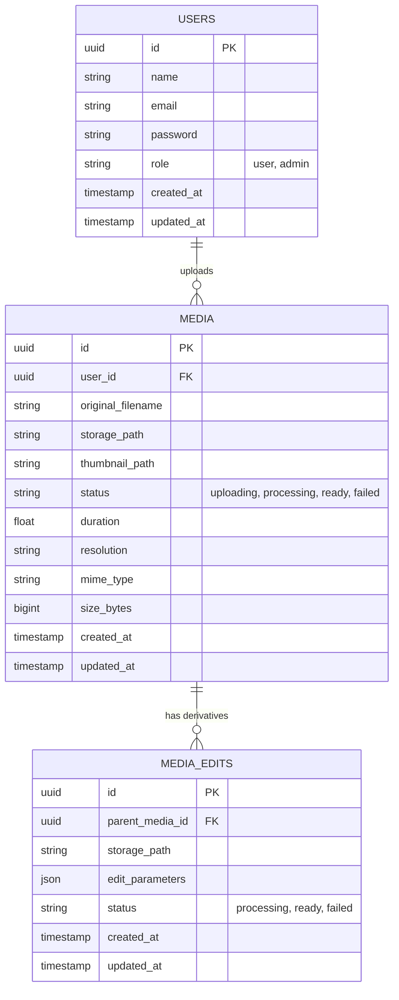
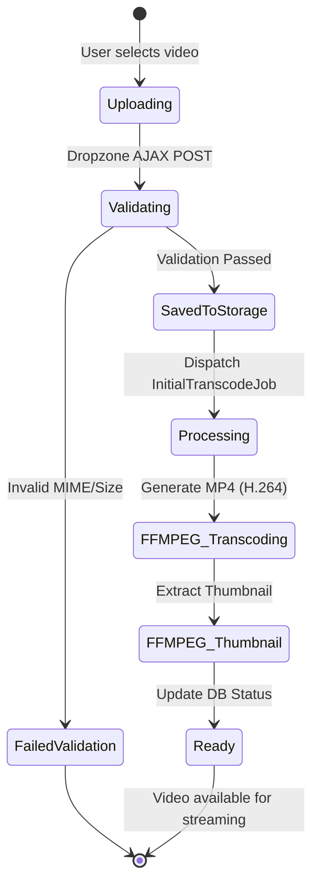
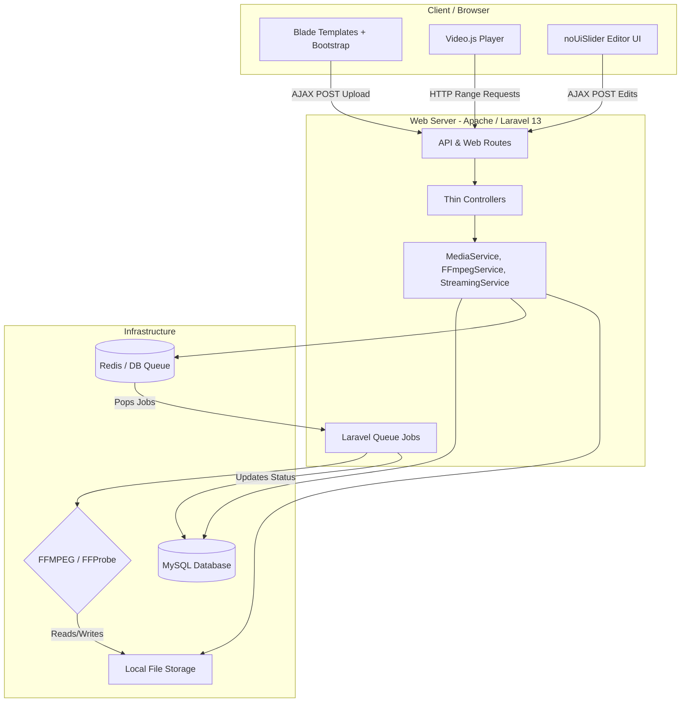
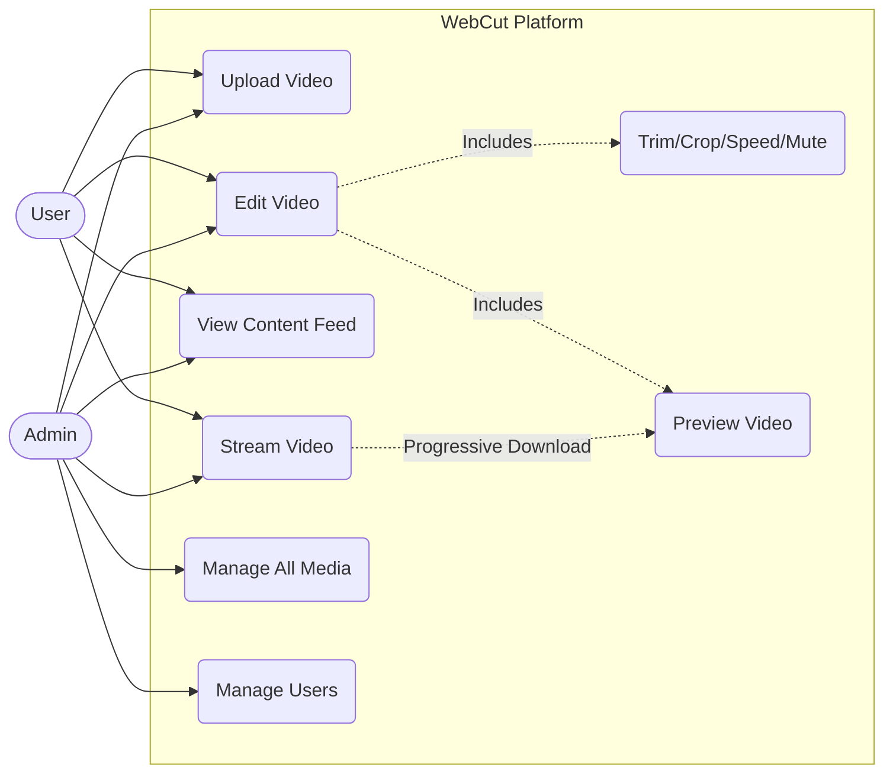

# WebCut System Diagrams

These diagrams visualize the architecture, data models, user flows, and use cases for the WebCut multimedia platform.

## 1. Entity-Relationship Diagram (ERD)

## 2. Activity Diagram (Upload & Processing)

## 3. Architecture Diagram

## 4. Use Case Diagram

